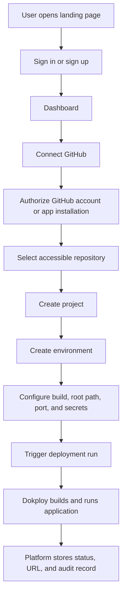

# CLAUDE.md

@AGENTS.md

This file is the primary operating guide for Claude in this repository.

# Product Direction

This repository is a production deployment control plane for Dokploy.

The product should let signed-in users connect GitHub, import authorized repositories, configure projects, environments, and secrets, trigger deployments, and review deployment history.

The old "paste GitHub URL" flow is still useful, but only as an advanced fallback for public repositories. The primary production workflow must be identity-first and permission-aware.

# Primary User Flow



# Current Stack

- Next.js 16 App Router
- React 19
- TypeScript
- Prisma 7
- Neon PostgreSQL
- Better Auth
- Zod
- Dokploy API
- shadcn-style UI primitives

# Already Configured

- Prisma with PostgreSQL provider
- Neon-oriented Prisma setup
- Better Auth auth models in Prisma
- Better Auth API route under `app/api/auth/[...all]/route.ts`
- Initial email/password and social login direction

# Production Domain Model

Use these concepts when planning or implementing:

- `User`: signed-in platform user from Better Auth.
- `Account`: Better Auth provider account, including email/password and GitHub social login.
- `GitHubConnection`: repo access connection. Long term this should be a GitHub App installation or equivalent scoped connection, not one global token.
- `Project`: long-lived deployable app linked to a repository.
- `Environment`: deploy target for a project, such as production, staging, or preview.
- `DeploymentRun`: one attempt to deploy one commit to one environment.
- `ProjectSecret`: encrypted environment variable scoped to a project/environment.
- `Domain`: generated or custom hostname mapped to an environment.
- `AuditEvent`: record of who did what, when, and against which project/environment.
- `WebhookEvent`: inbound provider event that must be processed idempotently.

# Architecture Rules

- Use one standard folder structure.
- Keep `app/` for routes, layouts, and route handlers.
- Keep feature code in `features/<feature>/`.
- Keep shadcn primitives in `components/ui/`.
- Keep dashboard shell and sidebar composition in `features/dashboard/components/`.
- Keep Prisma client in `lib/prisma.ts`.
- Keep other cross-feature infrastructure in `shared/`.
- Keep Prisma schema as the source of database truth.
- Keep generated Prisma client code out of app-owned feature code.
- Do not put business orchestration inside route handlers.
- Do not put server-only provider clients inside Client Components.
- Use Server Components by default. Add `"use client"` only at interactive UI boundaries.
- Do not add new code to `server/providers`, `server/services`, `components/deployment`, or `types/index.ts`.

# Naming Rules

- Use kebab-case for files and folders.
- Use PascalCase for React components and Prisma models.
- Use camelCase for functions and variables.
- Use lower-case route segments.
- Name Zod schema files with `.schema.ts`.
- Name Server Action files with `.action.ts`.
- Use `Project`, `Environment`, and `DeploymentRun` as the main domain names.
- Do not use `Deployment` to mean both a long-lived app and one deploy attempt.

# Auth Rules

- Better Auth owns user identity, sessions, and provider accounts.
- Email/password and GitHub social login are both supported identity paths.
- GitHub social login alone is not enough for production repo access unless the OAuth scopes and token lifecycle are explicitly designed.
- Prefer GitHub App installation for production repo import, selected repo permissions, webhooks, and private repo access.
- Protected pages, server actions, and route handlers must validate the session server-side.
- Proxy/cookie checks may be used for redirects, but server actions and route handlers must still validate session and authorization.

# Deployment Rules

- Dokploy is the execution backend.
- This platform is the control plane and source of truth for user/project/deployment ownership.
- Deployment requests must be idempotent.
- Only one active deployment mutation should run per project/environment unless explicitly designed otherwise.
- A deployment run must be tied to a project, environment, commit SHA, actor, source provider, and status.
- Client polling can update UI, but backend state should eventually be reconciled by webhook or worker.
- Do not persist only the final status. Persist enough data to debug failures.

# Security Rules

- Never commit `.env` or real secrets.
- Never log access tokens, refresh tokens, Dokploy keys, GitHub tokens, or project secrets.
- Encrypt project/environment secrets at rest before production.
- Never return secret values to the browser after save.
- Validate all external input with Zod or equivalent runtime schemas.
- Prefer Zod for both client and server validation.
- Reuse the same Zod schema for a form and its server boundary when possible.
- Enforce ownership checks on every project, environment, deployment, secret, domain, and webhook-controlled mutation.
- Rate limit auth, repo import, deployment trigger, and webhook endpoints.

# UI Rules

- Use shadcn-style primitives for shared controls.
- Do not add plain Tailwind-only controls when a reusable shadcn primitive should exist.
- Put feature UI in `features/*/components`.
- Put dashboard layout and sidebar code in `features/dashboard/components`.
- Keep `app/page.tsx` as the public landing page with sign-in and sign-up actions for signed-out users.
- Dashboard routes must require a session.

# Claude Workflow

For every non-trivial task:

1. Read the relevant docs in this repo.
2. Read the relevant local Next.js docs in `node_modules/next/dist/docs/`.
3. Inspect the current code before changing files.
4. State the impacted feature and ownership boundary.
5. Keep the change narrowly scoped.
6. Add or update a PRD/phase document when the task changes product scope.
7. Run the smallest useful verification command.
8. Report changed files, verification, and remaining risks.

For large work, ask the owner to approve the phase before implementation.

# Commands

```bash
npm run dev
npm run lint
npm run build
```

Use Prisma commands only when the task changes Prisma schema or generated client output.

# Important Local Docs

- `docs/architecture/production-domain.md`
- `docs/architecture/nextjs-feature-structure.md`
- `docs/architecture/integration-notes.md`
- `docs/agents/claude-workflow.md`
- `PRD.md`
- `plan.md`
