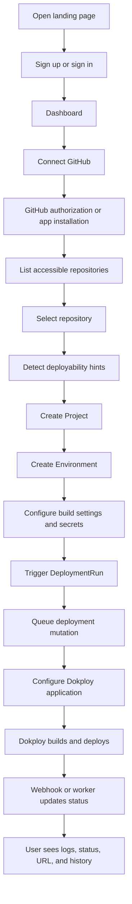

# PRD: Production GitHub-to-Dokploy Deployment Platform

## Goal

Build a production deployment platform where signed-in users can connect GitHub, import allowed repositories, configure projects and environments, deploy through Dokploy, and track every deployment run with ownership, status, logs, and audit history.

This app is a control plane. Dokploy performs build/runtime execution. This app owns identity, permissions, project configuration, deployment intent, state tracking, and operational history.

## Product Positioning

The product is not "paste any repo and hope it deploys."

The product is:

```text
Permission-aware repo import + repeatable deployment management + deployment history + operational safety
```

## Primary Production Flow



## Secondary Flow

Manual GitHub URL import may remain as an advanced fallback:

- public repositories only
- must be clearly labeled as limited
- must not use one global GitHub token for private repo access
- must validate deployability before creating a project

## Target Users

| Role              | Need                                                               |
| ----------------- | ------------------------------------------------------------------ |
| Solo developer    | Deploy projects without repeatedly configuring Dokploy manually    |
| Small team member | Know who deployed what, to which environment, and with what result |
| Platform owner    | Keep deploy access controlled, auditable, and recoverable          |

## Core Product Concepts

| Concept          | Meaning                                                                     |
| ---------------- | --------------------------------------------------------------------------- |
| User             | Better Auth user identity                                                   |
| Account          | Better Auth provider account, such as email/password or GitHub              |
| GitHubConnection | Scoped repo access connection, preferably GitHub App installation long term |
| Project          | Long-lived app linked to a source repository                                |
| Environment      | Deploy target such as production, staging, or preview                       |
| DeploymentRun    | One deploy attempt for one commit and environment                           |
| ProjectSecret    | Encrypted environment variable scoped to project/environment                |
| Domain           | Generated or custom hostname mapped to an environment                       |
| AuditEvent       | Immutable record of important user/system actions                           |
| WebhookEvent     | Inbound provider event processed idempotently                               |

## Supported V1 Scope

### In Scope

- Better Auth email/password login
- Better Auth GitHub social login
- Public landing page with sign-in and sign-up actions
- Dashboard for signed-in users
- GitHub repo selection from connected account where practical
- Manual public repo URL fallback
- Project creation
- Environment creation
- Dockerfile deployment mode
- Static deployment mode with explicit publish directory
- Deployment run history
- Dokploy application configuration and deploy trigger
- Status/log display
- Neon PostgreSQL persistence
- Zod validation on client forms and server boundaries
- shadcn-style UI primitives

### Out of Scope For First Production Pass

- multi-cloud deployment providers
- full CI/CD workflow engine
- framework auto-detection for every stack
- team billing and permissions
- advanced rollback UI
- runtime shell access
- Kubernetes abstraction

## Auth And Repo Access Rules

- GitHub social login proves identity.
- Repo access requires an explicit repo access design.
- For production private repo import, prefer GitHub App installation because it supports selected repositories, installation permissions, and webhooks.
- OAuth token use is acceptable only if token scopes, refresh behavior, revocation, and ownership checks are explicitly implemented.
- Do not import private repos through a single server-owned `GITHUB_TOKEN`.

## Deployment Rules

- Detection is advisory. User confirmation is required before deployment.
- Dockerfile deploys require root directory, Dockerfile path, and container port.
- Static deploys require explicit publish directory.
- Monorepos must be supported through root directory selection.
- Deployment requests must be idempotent.
- Concurrent deployment mutations for the same project/environment must be serialized or rejected.
- Deployment status must not depend only on an open browser tab.

## Data Model Direction

The current `Deployment` model is a prototype model. Production should split it into long-lived configuration and per-run history.

Recommended production models:

- `User`
- `Account`
- `Session`
- `Verification`
- `GitHubConnection`
- `Project`
- `Environment`
- `DeploymentRun`
- `ProjectSecret`
- `Domain`
- `AuditEvent`
- `WebhookEvent`

## API/Server Boundary Requirements

- Route handlers are public HTTP endpoints. Treat every request as untrusted.
- Server actions are server-side, but still require validation and authorization.
- Every mutation must:
  - validate payload shape with Zod
  - validate session
  - validate ownership
  - execute through a service/action layer
  - return safe client errors only
- Client forms should use the same Zod schemas when possible.
- Do not keep request and response contracts in `types/index.ts`.

## UX Requirements

- Public `/` page should be a real landing page.
- Signed-out users should see sign-in and sign-up actions.
- Signed-in users may be sent to the dashboard.
- First-run dashboard should guide the user to connect GitHub.
- Repo import should prefer a list of authorized repositories.
- Manual URL import should be visually secondary.
- Project setup should show deployment mode, branch, root directory, publish directory or port, and environment variables.
- Deployment screen should show queued/building/done/error states.
- Failure states must show plain-language cause and next action.
- Project history should show actor, repo, branch, commit, environment, status, URL, and timestamp.

## Security Requirements

- No real secrets in git.
- Store provider tokens securely.
- Encrypt project secrets before production.
- Never send saved secret values back to the client.
- Never log secrets or provider payloads containing secrets.
- Rate limit auth, imports, deploy triggers, and webhooks.
- Audit important actions.
- Reject unauthorized project/environment/deployment access at the server boundary.

## Infrastructure Requirements

- Use Neon pooled connection for runtime `DATABASE_URL`.
- Use Neon direct connection for Prisma CLI `DIRECT_URL`.
- Use Prisma 7 datasource without `url` in `schema.prisma`; configure connection through Prisma config and adapter.
- Use Better Auth `nextCookies()` when server actions need auth cookie updates.
- Use Next.js 16 `proxy.ts` for route protection redirects when needed, but still perform real auth checks in pages/actions/routes.
- Follow the local official Next.js docs in `node_modules/next/dist/docs/`.

## Next.js Requirements

These rules come from the local official Next.js docs for the installed version.

- `app/page.tsx` creates the `/` page.
- `app/layout.tsx` is required and wraps the app.
- folders in `app/` define route segments.
- route groups like `(auth)` and `(dashboard)` do not change the URL.
- a route becomes public only when it has `page.tsx` or `route.ts`.
- `route.ts` files are Route Handlers and are public HTTP endpoints.
- do not put `route.ts` and `page.tsx` in the same route segment.
- pages and layouts are Server Components by default.
- use Client Components only for state, events, effects, browser APIs, or client hooks.
- Server Actions can be called by direct POST requests, so they must check auth and authorization.
- use `proxy.ts` only for light redirects or checks. Do real auth checks in pages, actions, and routes.

## Structure Requirements

- Use `app/` for routes, layouts, route handlers, and route groups.
- Use `features/*` for product code.
- Use `components/ui/*` for shadcn primitives only.
- Use `lib/prisma.ts` for the Prisma client.
- Use `shared/*` for other cross-feature infrastructure.
- Do not add new code to `server/providers`, `server/services`, `components/deployment`, or `types/index.ts`.

## Naming Requirements

- files and folders use kebab-case
- React components and Prisma models use PascalCase
- functions and variables use camelCase
- schema files use `.schema.ts`
- Server Action files use `.action.ts`
- main domain names are `Project`, `Environment`, and `DeploymentRun`
- avoid the broad name `Deployment`

## Success Criteria

- A user can create an account and sign in.
- Signed-out users see the landing page with sign-in and sign-up actions.
- A user can connect GitHub or use a limited public repo fallback.
- A user can create a project from an authorized repo.
- A user can configure production/staging environment settings.
- A user can trigger a deployment run through Dokploy.
- The platform stores deployment run history and status.
- The platform prevents cross-user project access.
- Secrets are not exposed in UI, logs, or API responses.

## Architecture References

- `docs/architecture/production-domain.md`
- `docs/architecture/nextjs-feature-structure.md`
- `docs/agents/claude-workflow.md`
