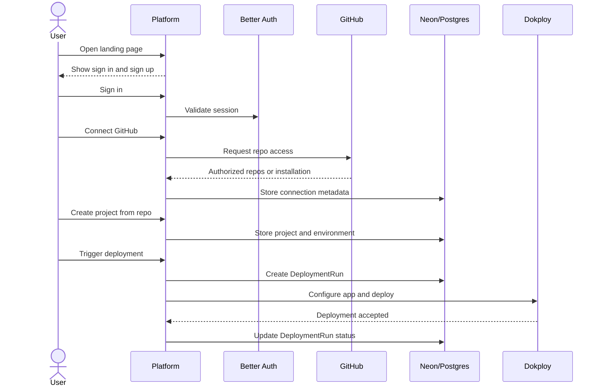
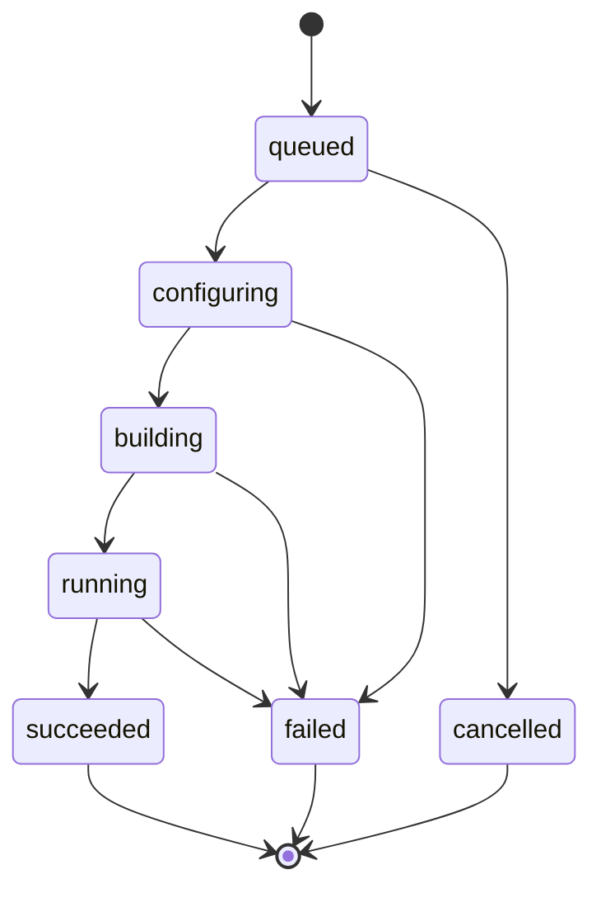

# Production Domain Guide

This project is a deployment platform control plane. It does not build containers itself. It records user intent, validates access, configures Dokploy, starts deployments, and tracks results.

## Mental Model

```text
User signs in.
User owns Projects.
A Project connects to one source repository.
A Project has Environments.
An Environment has deploy settings, domains, and secrets.
A DeploymentRun records one deploy attempt.
Dokploy runs the deployment.
```

## Core Entities

| Entity | Purpose | Must Know |
| --- | --- | --- |
| User | Authenticated platform actor | Comes from Better Auth |
| Account | Provider identity | Better Auth stores email/password and GitHub provider links |
| GitHubConnection | Repo access relationship | Prefer GitHub App installation for production repo access |
| Project | Long-lived deployable app | Belongs to a user, points at a repo |
| Environment | Deploy target | Examples: production, staging, preview |
| DeploymentRun | One deploy attempt | References project, environment, actor, commit, status |
| ProjectSecret | Secret config | Encrypted, scoped, never returned in plaintext |
| Domain | Public hostname | Generated or custom, attached to environment |
| AuditEvent | Security/history record | Who did what, when, and against which resource |
| WebhookEvent | Inbound provider event | Must be processed idempotently |

## Production Flow



## GitHub Login vs GitHub Repo Access

GitHub social login answers:

```text
Who is this user?
```

GitHub repo access answers:

```text
Which repositories may this platform read, clone, and receive webhooks for?
```

Do not mix these concepts. A GitHub social account can be useful for identity, but production private repo access should be handled through a scoped GitHub App installation or a carefully designed OAuth token flow.

## Naming Rules

- Use `Project` for the long-lived app.
- Use `Environment` for a deploy target.
- Use `DeploymentRun` for one deploy attempt.
- Use `ProjectSecret` for encrypted environment or project secrets.
- Use `Domain` for a public hostname.
- Do not use `Deployment` as a broad name.
- Use lower-case status values.

## Deployment State Machine

Use this status model for `DeploymentRun`:



Keep UI labels simple, but preserve enough backend state for debugging.

## Concurrency Rules

- One active deployment mutation per project/environment.
- Duplicate deploy requests must use an idempotency key.
- Create the local `DeploymentRun` before calling Dokploy.
- If Dokploy succeeds but local update fails, reconciliation must be possible.
- Webhook events must be stored and deduplicated before processing.

## Security Rules

- Every user-owned row needs an owner path.
- Every query must filter by owner or be explicitly system-scoped.
- Every mutation must validate session and authorization.
- Provider tokens and project secrets must not be returned to clients.
- Audit important changes: project create/delete, environment changes, secret mutations, deployment triggers, domain changes.

## Domain Decisions Still Needed

- GitHub App first, OAuth repo scopes first, or both?
- Individual users only first, or teams from the start?
- Which deployment modes are V1: Dockerfile only, or Dockerfile plus static?
- Which queue/reconciliation mechanism will be used?
- Secret encryption key management approach.
